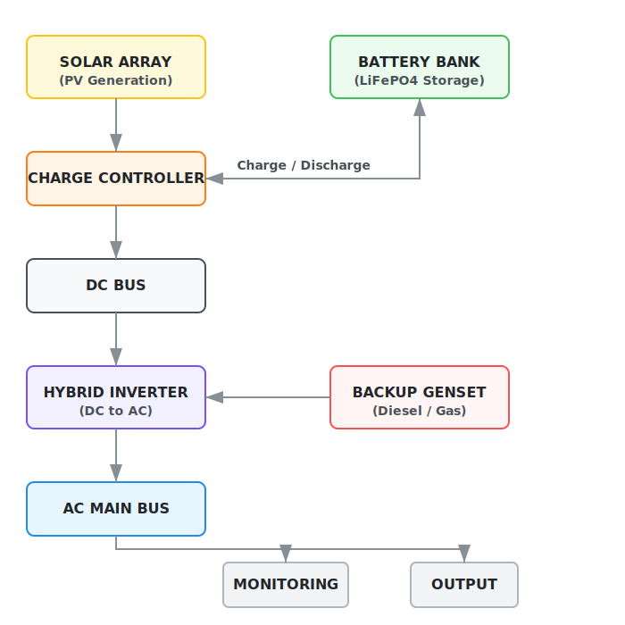
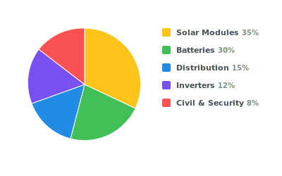
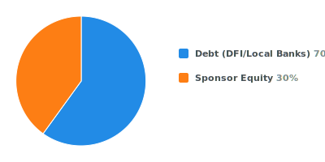

# Internal Preparation: Solar Mini-Grid Client Meeting

---

## 0. Executive Project Snapshot
**Goal:** Provide immediate financial and technical scale to decision-makers.

| Metric | Target / Estimate (Template) |
| :--- | :--- |
| **Location** | [Insert Site/Community Name], Nigeria |
| **Estimated Load** | [e.g., 450 kWh/day Peak] |
| **Proposed PV Capacity** | [e.g., 150 kWp] |
| **Battery Storage** | [e.g., 480 kWh LiFePO4] |
| **Estimated CAPEX** | $[Amount] |
| **Target Tariff** | ₦[Amount] / kWh |
| **Diesel Displacement** | 85% - 95% |
| **ROI Period** | 4.5 - 6 Years |

---

## 1. Meeting Objectives & Strategy
**Goal:** Establish technical credibility as a **Rural Utility Infrastructure Developer**.

### Discussion Topics
*   Validation of current energy pain points (diesel and gas costs, uptime).
*   High-level alignment on the proposed mini-grid capacity.
*   Clarifying the regulatory and community engagement roadmap.

<!-- ### Speaker Notes
> "We are here to design a utility-grade asset structured for institutional capital. Our goal is a 25-year infrastructure play, not just a solar installation." -->

---

## 2. Client Discovery Questions
**Goal:** Fill the data gaps required for accurate sizing and bankability.

### Discussion Topics
*   **Current Load:** Peak demand timing (Residential: 7PM-10PM vs. Productive Use: 10AM-4PM).
*   **Diesel/gas Spend:** Monthly budget for fuel and generator maintenance?
*   **Growth:** Projected expansion for the community/facility in 3-5 years?
*   **Land:** Availability of secured perimeter for the PV array?

---

## 3. What is a Solar Mini-Grid?
**Goal:** Define the solution as a self-sustaining utility-grade power plant.

### Presentation Tips
*   **The "Local Power Station":** Frame it as a decentralized utility that provides higher reliability than the national grid (DisCo).

---

## 4. System Architecture & Load Profile
**Goal:** Visualize energy flow and demonstrate how we manage 24/7 demand.

### Energy Flow Diagram

### Load Profile Management
*   **Daytime:** PV powers the load directly and charges batteries.
*   **Evening Peak:** Battery bank discharges to cover residential surges.
*   **Backup:** Integrated hybrid controller allows for generator fallback during extended rain/harmattan.

---

## 5. Transmission & Transformer Integration
**Goal:** Explain the engineering behind long-distance distribution.

### Distribution Layout

---

## 6. Technical Overview & Specs
**Goal:** Demonstrate industrial-grade engineering.

### Discussion Topics
*   **Generation:** Tier-1 Monocrystalline modules (High humidity/heat tolerance).
*   **Storage:** Lithium Iron Phosphate (LiFePO4) – 6,000+ cycle life.
*   **Meters:** STS-compliant Pre-paid smart meters with GSM/GPRS monitoring.

### Speaker Notes
> "We avoid Lead Acid. In the Nigerian climate, LiFePO4 is the only way to ensure a 10-year battery lifecycle. We model degradation at 70% capacity after 10 years, with a built-in replacement cycle."

---

## 7. Productive Use & Anchor Load Strategy
**Goal:** Ensure project bankability through stable daytime demand.

### Discussion Topics
*   **Anchor Loads:** Identifying mills, cold storage, or water pumping to consume daytime surplus.
*   **SME Support:** Strategy for powering welding shops, salons, and charging hubs.
*   **Revenue Stability:** Productive use customers provide the reliable cash flow needed for high ROI.

---

## 8. Financial Model & Business Case
**Goal:** Prove the economic superiority and realistic ROI of the mini-grid.

### Concrete Comparison 
| Factor | Diesel Generator | Gas Generator (CNG/LPG) | Solar Mini-Grid |
| :--- | :--- | :--- | :--- |
| **Fuel Cost** | ₦1,200+ / Litre | Variable (Market Dependent) | ₦0 (Free Sun) |
| **Real Cost/kWh** | ≈ ₦380 - ₦450 | ≈ ₦280 - ₦350 | ₦200 - ₦280 (Target) |
| **Maintenance** | Weekly / Monthly | Frequent (High heat engine) | 2% - 3% of CAPEX Annually |
| **Inflation Risk** | Very High | High | Low (Fixed Asset) |

### CAPEX Composition (Typical 150kWp System)

*   **Solar Modules:** 35%
*   **Batteries:** 30%
*   **Inverters & Controls:** 12%
*   **Distribution Network:** 15%
*   **Civil Works & Security:** 8%

### Financial Assumptions
*   **Collection Efficiency:** 92% (Via pre-paid metering).
*   **Technical Losses:** 3%.
*   **Commercial Losses:** 5% (Bypass mitigation).
*   **Target Project IRR:** 16% – 22% (Unlevered).

---

## 9. Regulatory Framework & Grid Encroachment
**Goal:** Mitigate legal and interconnection risks through NERC compliance.

### Key Points
*   **NERC Compliance:** Adherence to the **Nigerian Electricity Regulatory Commission (NERC)** Mini-Grid Regulation 2016.
*   **Legal Precision:** This project will operate under the 2016 Mini-Grid Regulation issued by NERC, applicable to isolated systems up to 1MW capacity.
*   **Licensing:** Identifying if the site requires a **Permit** (>100kW) or **Registration** (<100kW).
*   **Grid Arrival Scenario:** 
    1.  Interconnection agreement with DisCo.
    2.  Asset buyout per NERC formula (depreciated asset valuation).
    3.  Conversion to embedded generation for the local community.

---

## 10. Risk & Mitigation
**Goal:** Proactively address investor and client fears.

| Risk | Mitigation Strategy |
| :--- | :--- |
| **FX Volatility** | USD-indexed equipment contracts / Naira-hedging / Tariff escalation clauses. |
| **Theft/Vandalism** | Perimeter sensors, community-stakeholder security models. |
| **Harmattan Dust** | Oversized PV array + automated/scheduled cleaning. |
| **Non-Payment** | Pre-paid smart meters (No Pay, No Power). |
| **Social Risk** | See Section 10B: Community Engagement Strategy. |

---

## 10A. Capital Structure & Funding Strategy
**Goal:** Demonstrate project finance sophistication.

### Capital Structure (Template)

*   **30% Sponsor Equity**
*   **70% Debt** (7–10 year tenor with DFI or local infrastructure banks).
*   **Target DSCR:** 1.3x – 1.5x (Debt Service Coverage Ratio).

### Revenue Waterfall (Order of Priority)
1.  **O&M Costs** (Operations & Maintenance)
2.  **Debt Service** (Principal + Interest)
3.  **Battery Reserve Fund** (For Year 10 replacement)
4.  **Equity Returns** (Dividends)

---

## 10B. Community Engagement Strategy
**Goal:** Ensure social license to operate and long-term project stability.

### Key Initiatives
*   **Town Hall Consultations:** Early-stage transparency on tariffs and project benefits.
*   **Tariff Transparency:** Clear communication on how solar saves money compared to diesel.
*   **Local Employment Quota:** Hiring community members for security, site cleaning, and basic maintenance.
*   **Stakeholder Buy-in:** Engaging traditional and local leadership to prevent political interference.

---

## 11. Why Us? & Closing Strategy
**Goal:** Secure a commitment for the Technical Site Audit.

### Our Edge
1.  **Engineering-First:** We design utility-grade assets structured for institutional capital.
2.  **Regulatory Experts:** We handle the NERC, Environmental (EIA), and DisCo filings.
3.  **Local O&M:** Real-time remote monitoring from our operations center.

### Next Steps
*   **Technical Site Audit:** Schedule 48-hour load logging.
*   **Letter of Intent (LOI):** Formalize intent to proceed to the NERC permit phase.

<!-- ---
**Prepared by:** Infrastructure Consulting Team
**Confidentiality:** Internal Use Only -->
